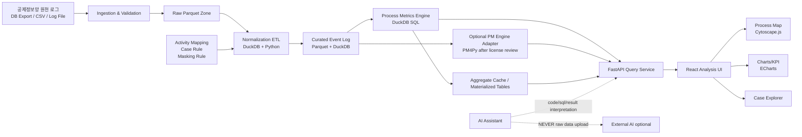

# 시스템 아키텍처 설계서

## 1. 설계 목표
공제정보망의 2,000만 건 이상 메서드/변수 로그를 단일 로컬 워크스테이션 또는 사내 분석 PC에서 처리하면서, 사용자가 기간·업무·조직·메서드·결과코드 등의 필터를 적용하여 실제 업무 프로세스 흐름과 병목을 탐색할 수 있도록 한다.

시스템은 다음 요구를 동시에 만족해야 한다.
- 외부 클라우드 업로드에 의존하지 않음
- 2천만+ 이벤트 스캔 가능
- 분석식 재현 가능
- 업무용 activity mapping 관리 가능
- 시각적 process map 제공
- 향후 서버형 또는 사내망 배포로 확장 가능
- AI 기능은 데이터 경계를 침범하지 않고 선택적으로 동작

## 2. 논리 아키텍처



## 3. 물리 배치 — MVP

```text
Local Workstation
├─ data/
│  ├─ raw/                  # git 제외, 원본 또는 export
│  ├─ parquet/raw/          # 원천 정규화 전 Parquet
│  ├─ parquet/curated/      # event log
│  └─ temp/                 # DuckDB spill
├─ db/
│  └─ process_mining.duckdb
├─ backend/
│  └─ FastAPI
├─ frontend/
│  └─ React
└─ logs/
   └─ application logs (PII 금지)
```

## 4. 데이터 계층

### 4.1 Raw Zone
목적: 원천의 의미를 보존하고 재처리 가능하게 유지한다.

권장 방식:
- 원천 DB에서 직접 장시간 분석하지 않는다.
- 필요한 로그 범위를 export한 후 Parquet으로 변환한다.
- 원본 파일에는 read-only 원칙 적용.
- 원천 파일 checksum, export date, source system version 기록.

### 4.2 Staging/Normalization
원천 필드의 데이터형을 통일하고 기술 이벤트를 분석 가능한 형태로 정규화한다.

대표 작업:
- timestamp parse
- malformed row 분리
- method/class/module 표준화
- params에서 case key 후보 추출
- PII masking
- source sequence 부여
- duplicate 판별

### 4.3 Curated Event Log
프로세스 마이닝이 사용하는 핵심 계층.

최소 필드:
- case_id
- activity
- event_ts
- event_id

권장 추가 필드:
- source_method
- module
- org_code
- actor_hash
- result_code
- duration_ms
- lifecycle
- source_sequence
- mapping_version
- case_rule_version
- ingestion_batch_id

### 4.4 Aggregate Layer
자주 조회하는 결과를 저장한다.
- DFG edge summary
- activity summary
- case summary
- variant summary
- daily/hourly throughput
- rework summary

모든 aggregate는 원천 event log와 규칙 버전에서 재생성 가능해야 한다.

## 5. 애플리케이션 계층

### 5.1 Query/Analytics Service
책임:
- filter validation
- parameterized SQL
- query timeout
- result size limit
- metric computation
- caching

API가 raw SQL 실행 권한을 사용자에게 직접 제공하지 않는 것을 원칙으로 한다.

### 5.2 Process Mining Engine
MVP에서 아래를 자체 SQL로 제공한다.
- Directly-Follows Graph
- activity frequency
- edge frequency
- case count
- start/end activity
- throughput time
- waiting time proxy
- rework
- variant
- bottleneck
- path filter

### 5.3 PM Adapter
고급 분석을 위한 인터페이스.

예상 인터페이스:
```text
ProcessModelProvider
  discover_model(filter_spec) -> model
  conformance(filter_spec, model_id) -> diagnostics
  export_model(model_id, format) -> artifact
```

PM4Py를 사용한다면 이 adapter 내부에서만 참조한다.

## 6. 프론트엔드 계층

### 6.1 Global Filter Bar
- 분석 기간
- 업무 영역
- 조직
- activity
- result code
- 최소 빈도
- case 속성
- variant

### 6.2 Overview
- 총 case 수
- 총 event 수
- 고유 activity 수
- 평균/중앙 throughput
- 재작업률
- 대표 병목

### 6.3 Process Map
Node = activity
Edge = directly follows

표현 옵션:
- frequency mode
- performance mode
- case percentage mode

상호작용:
- node click → activity 상세
- edge click → transition 상세
- threshold slider → noise 감소
- selected path → Case Explorer 연결

### 6.4 Variant Explorer
- variant rank
- case count
- share
- median throughput
- rework rate
- 대표 case

### 6.5 Case Explorer
개별 case의 event sequence를 제한적으로 조회한다.
원천 params 전체를 기본 표시하지 않는다.

## 7. AI 계층
AI는 분석 엔진의 보조 계층이다.

허용 예:
- 사용자의 자연어를 내부 filter spec으로 변환
- 사전 정의 metric 결과를 설명
- SQL 초안을 개발자에게 제안
- 성능 개선 코드 제안
- 합성 샘플 기반 테스트 생성

금지 예:
- 2천만 원천행을 외부 AI에 업로드
- case detail의 PII를 prompt로 전달
- AI가 생성한 SQL을 검증 없이 자동 실행

## 8. 기술 선택 근거

### DuckDB
- embedded analytical database로 별도 DB 서버가 불필요
- Parquet 직접 쿼리
- projection/filter pushdown
- grouping/join/sort/window에서 out-of-core 지원
- NVMe SSD 환경에 적합

### Parquet
- 컬럼형 저장
- 압축
- 필요한 컬럼만 읽는 분석에 적합
- 재처리 및 장기 보관이 용이

### FastAPI
- Python 분석 생태계와 결합이 쉬움
- 타입 기반 API 계약
- 로컬 서비스로 시작 후 사내망 서버로 확장 가능

### React
- 분석형 UI 구성과 상호작용에 적합
- Cytoscape/ECharts 생태계 활용

## 9. 확장 아키텍처
데이터가 수억~수십억 이벤트로 증가하거나 동시 사용자가 늘면 다음 순서를 검토한다.

1. Parquet partition 전략 개선
2. 사전집계 확대
3. DuckDB 파일/프로세스의 read concurrency 설계
4. 분석 작업을 background worker로 분리
5. 사내 서버 배포
6. 필요 시 ClickHouse / Spark / Trino 등 분산 계층 검토

DuckDB를 선택했다는 이유만으로 모든 규모에서 영구 고정하지 않는다. 2천만 이벤트는 DuckDB가 매우 유력한 시작점이지만, 성능은 실제 로그의 column 수·join cardinality·variant 폭발 정도에 따라 검증한다.

## 10. 주요 아키텍처 결정
- ADR-001: Local-first + DuckDB + Parquet
- ADR-002 예정: case_id 전략
- ADR-003 예정: activity mapping 관리
- ADR-004 예정: PM4Py 라이선스 및 도입 방식
- ADR-005 예정: single-user local vs intranet multi-user
